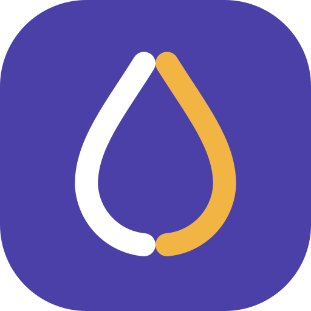
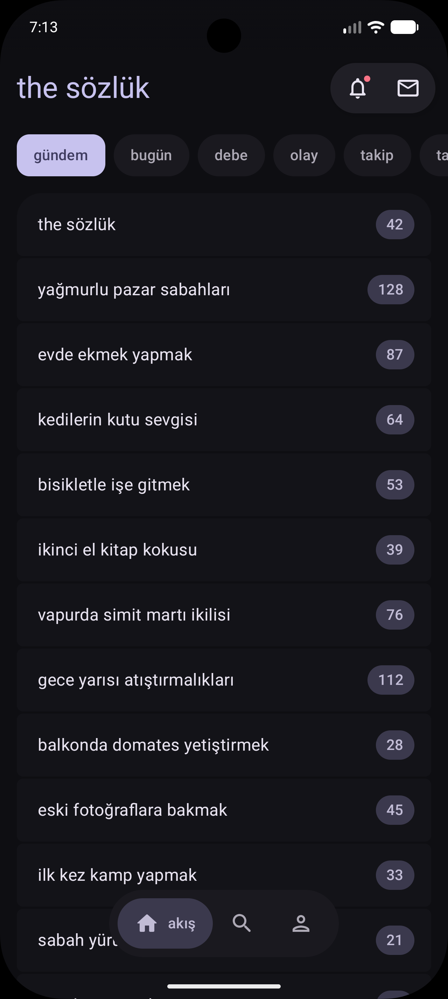
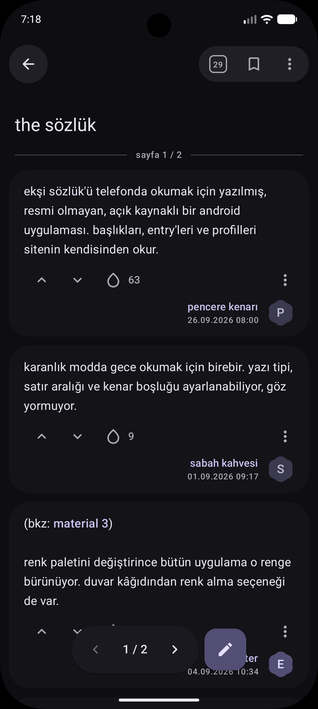
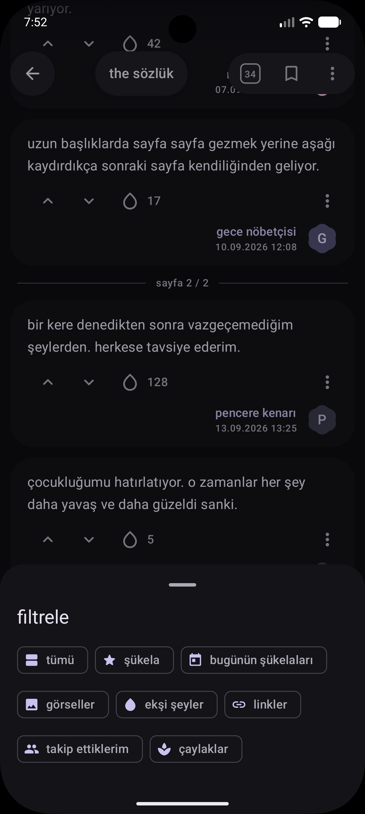
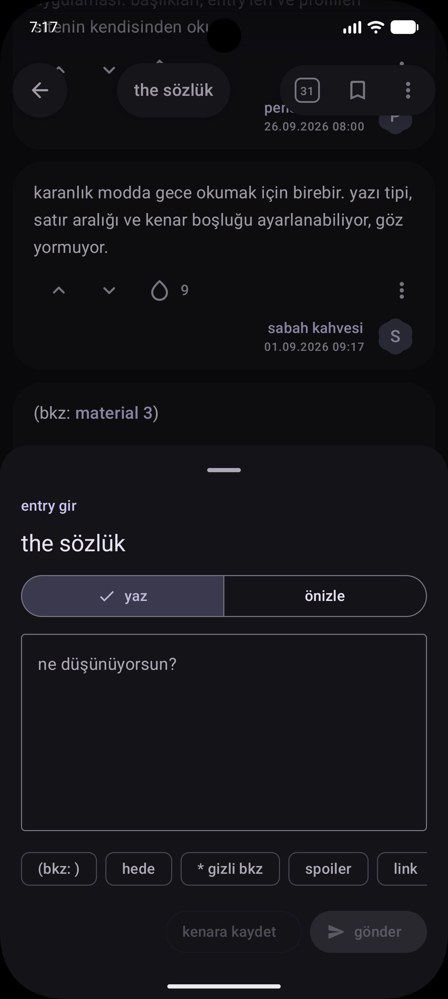
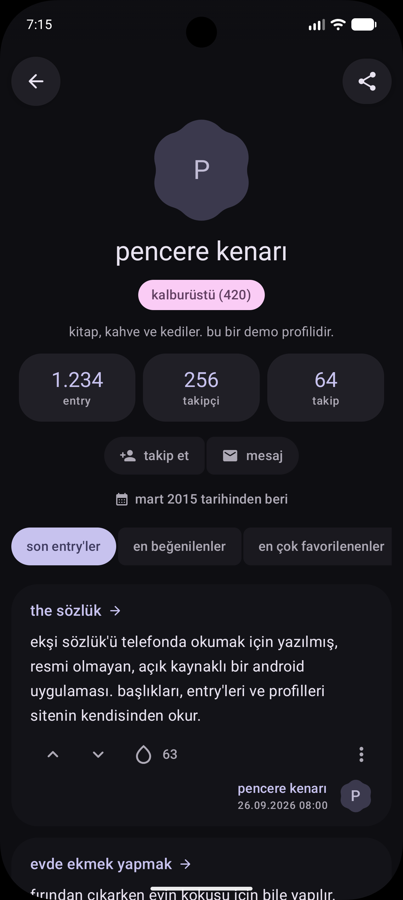
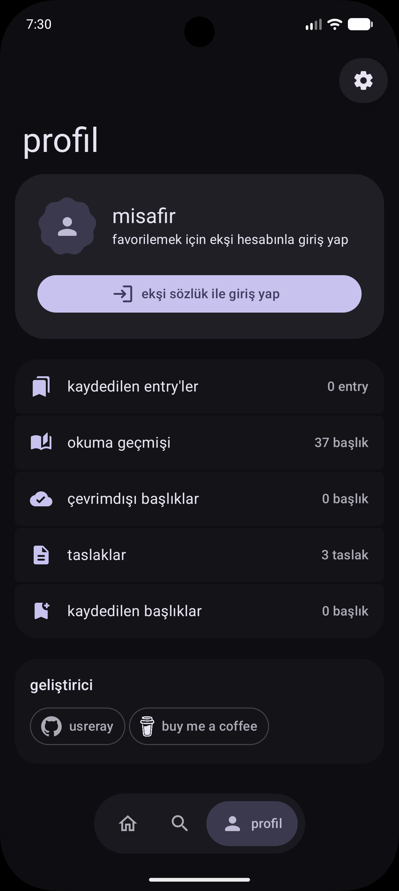
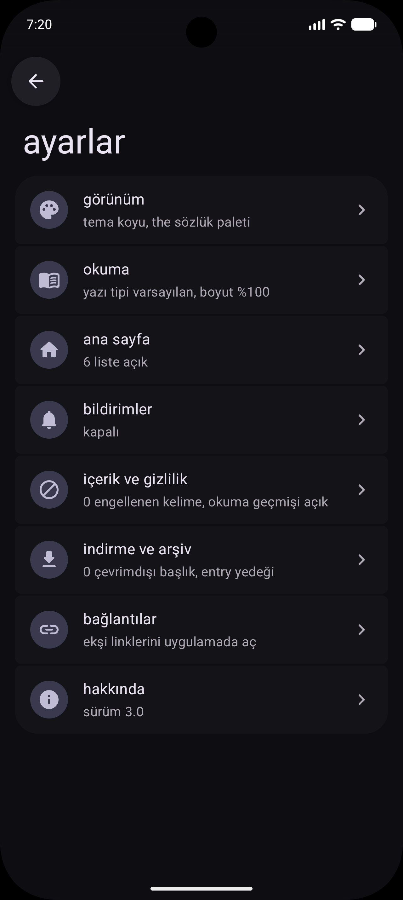
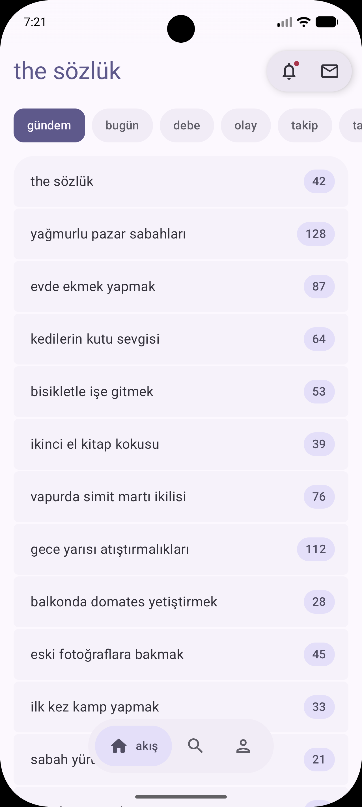

  

<h1 align="center">the sözlük</h1>

  ekşi sözlük'ü telefonda okumak için geliştirilmiş, zengin özelliklere sahip, resmi olmayan ve açık kaynaklı bir Android uygulaması.

  <a href="https://github.com/usreray/the-sozluk/releases/latest">İndir</a> ·
  <a href="#özellikler">Özellikler</a> ·
  <a href="#ekran-görüntüleri">Ekran görüntüleri</a>

---

## Ekran görüntüleri

> Bu bölümdeki ekran görüntüleri, bu amaçla hazırlanmış örnek içerik kullanılarak alınmıştır. Görüntülerde yer alan başlıklar, entry'ler ve kullanıcı adları gerçek değildir; üçüncü kişilere ait içeriklerin yayımlanmaması amacıyla bu yöntem tercih edilmiştir. Uygulamanın gerçek kullanımında tüm içerik eksisozluk.com üzerinden sağlanır.

<table>
  <tr>
    <td align="center"> Gündem</td>
    <td align="center"> Başlık ve entry'ler</td>
    <td align="center"> Başlık filtreleri</td>
  </tr>
  <tr>
    <td align="center"> Entry yazma</td>
    <td align="center"> Yazar profili</td>
    <td align="center"> Profil ve kütüphane</td>
  </tr>
  <tr>
    <td align="center"> Ayarlar</td>
    <td align="center"> Açık tema</td>
    <td></td>
  </tr>
</table>

## Özellikler

### Okuma
- Gündem, bugün, debe, olay, takip ve kanal listeleri
- Kaydırdıkça otomatik yüklenen sayfalar ve istenen sayfaya doğrudan geçiş
- Başlık filtreleri: şükela, bugünün şükelaları, görseller, linkler, ekşi şeyler, benimkiler, takip ettiklerim ve çaylaklar
- Başlık içinde arama ve yazar, tarih aralığı ile sıralama seçenekleri sunan ayrıntılı arama
- Bkz ve bağlantıların uygulama içinde açılması, spoiler gizleme ve tam ekran görsel görüntüleyici
- Yazı tipi, satır aralığı ve kenar boşluğu ayarları

### Yazma ve hesap
- ekşi sözlük hesabıyla giriş; favori, oy, takip ve yorum işlemleri
- Entry yazma ve düzenleme; bkz, hede, gizli bkz, spoiler ve bağlantı araçları ile önizleme
- Galeriden görsel ekleme (konum gibi fotoğraf bilgileri kaldırılarak)
- Cihazda saklanan taslaklar ve mesajlaşma

### Arşiv
- Başlıkları indirerek internet bağlantısı olmadan okuma
- Entry kaydetme ve not ekleme, okuma geçmişi
- Kullanıcının kendi entry'lerini Markdown dosyası olarak yedekleme
- Entry'leri görsel olarak paylaşma

### Görünüm ve sistem
- Material 3 tasarımı; açık, koyu ve tam siyah tema seçenekleri; renk paletleri ve duvar kâğıdı renkleri
- Gündem widget'ı ve uygulama simgesi kısayolları (ara, mesajlar, olay)
- eksisozluk.com bağlantılarının uygulamada açılması
- Tablet ve yatay ekranlarda iki bölmeli görünüm
- Yeni olay ve mesajlar için isteğe bağlı bildirimler

## Kurulum

Uygulamanın son sürümüne ait APK dosyası [Releases](https://github.com/usreray/the-sozluk/releases/latest) sayfasından indirilebilir. Android 12 veya üzeri bir sürüm gereklidir.

## Gizlilik

- Uygulama yalnızca eksisozluk.com ile iletişim kurar; herhangi bir analiz, reklam veya izleme bileşeni içermez.
- Oturum bilgileri yalnızca cihazda saklanır.
- Okuma geçmişi, taslaklar ve kaydedilen içerikler cihaz dışına aktarılmaz.
